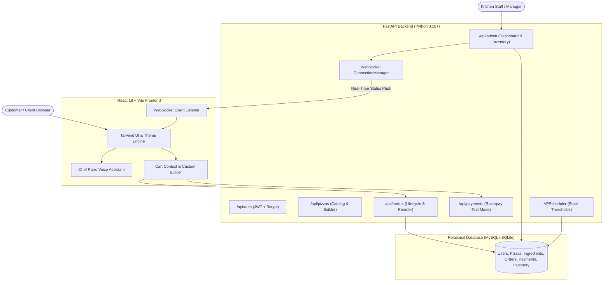

# 🍕 PizzaHub – Full-Stack Artisanal Pizza Delivery & Real-Time Kitchen Inventory Management System

<div align="center">


**A Production-Grade Full-Stack Artisanal Pizza Web Application with Real-Time WebSockets, Voice Assistant, Custom Builder, and Kitchen Inventory Controls.**

*Developed for **Oasis Infobyte Internship — Level 3 Task 1 (Web Development)***

</div>

---

## 📑 Table of Contents
- [🌟 Key Features](#-key-features)
  - [👤 1. Customer Experience & Ordering](#-1-customer-experience--ordering)
  - [🎨 2. Dual-Atmosphere Visual Theme System](#-2-dual-atmosphere-visual-theme-system)
  - [👨‍🍳 3. Chef Pizzo 3D AI Voice & Location Assistant](#-3-chef-pizzo-3d-ai-voice--location-assistant)
  - [🛡️ 4. Admin & Kitchen Operations Portal](#-4-admin--kitchen-operations-portal)
- [🏗️ System Architecture](#️-system-architecture)
- [📁 Repository Structure](#-repository-structure)
- [🎨 Color Palette & Typography Hierarchy](#-color-palette--typography-hierarchy)
- [🔌 API Endpoints Reference](#-api-endpoints-reference)
- [⚡ Quick Start & Run Guide](#-quick-start--run-guide)
- [🔑 Default Credentials for Evaluation](#-default-credentials-for-evaluation)
- [🧪 End-to-End Testing Workflow](#-end-to-end-testing-workflow)
- [🛡️ Business Rules & Integrity Guarantees](#️-business-rules--integrity-guarantees)
- [👨‍💻 Author & Submission](#-author--submission)

---

## 🌟 Key Features

### 👤 1. Customer Experience & Ordering
- **25+ Handcrafted Pizza Varieties**:
  - *Classic Italian Collection*: Margherita Classica, Farmhouse Delight, Double Cheese Margherita, Peppy Paneer, Veggie Supreme, Fiery Jalapeno Crunch.
  - *Artisan Special Pizzas*: Truffle Mushroom & Burrata, Burrata Pesto Rosso, Smoked Quattro Formaggi, Caramelized Onion & Brie.
  - *Natural Artisan Spotlight*: Hand-stretched 72h cold-fermented wild sourdough pies made with organic Italian Caputo 00 flour and fresh buffalo mozzarella.
  - *Spicy & Fiery Pizzas*: Peri-Peri Inferno, Spicy Paneer Tikka, Jalapeno Diablo Feast.
  - *Cheesy Overload Pizzas*: Triple Cheese Volcano, Garlic Herb 4-Cheese Burst, Ricotta & Sun-Dried Tomato.
  - *Gourmet & Healthy Pizzas*: Mediterranean Garden, Spinach & Artichoke Heart, Vegan Truffle Harvest.
- **Dual Action Buttons on Every Pizza**: Instant **"Add to Cart"** and express checkout **"⚡ Buy Now"**.
- **5-Step Interactive Custom Pizza Builder**:
  1. **Crust Base**: Classic Hand-Tossed, Thin Crust, Cheese Burst, 100% Whole Wheat, Artisan Sourdough.
  2. **Gourmet Sauces**: San Marzano Marinara, Spicy Peri-Peri, Creamy Garlic Alfredo, Basil Pesto, Smoky BBQ.
  3. **Cheeses**: Fresh Buffalo Mozzarella, Sharp Wisconsin Cheddar, Smoked Gouda, Greek Feta, Vegan Mozzarella.
  4. **Garden Fresh Toppings (Multi-Select)**: Bell peppers, olives, mushrooms, jalapenos, sweet corn, paneer, and sun-dried tomatoes.
  5. **Dynamic Real-Time Pricing & Stock Validation**: Updates price dynamically and disables out-of-stock items.
- **Shopping Cart & Checkout**:
  - Dynamic subtotal, 5% GST calculation, and threshold-based free express delivery.
  - **Chef Pizzo AI GPS Location Assistant**: Automatically detects user coordinates via browser geolocation with reverse geocoding into delivery address.
- **Razorpay Test Mode Checkout**: Seamless payment simulation with modal and instant server-side signature verification.
- **Distinct Order Ledger & Real-Time WebSocket Order Tracking**:
  - **Orders Ledger (`/orders`)**: Dedicated history page with account statistics (Total Orders, Total Spent, In-Flight Orders), filter tabs (*All*, *Active In-Flight*, *Delivered*, *Cancelled*), receipt breakdown modals, and 1-click reorder.
  - **Live Order Tracker (`/track` & `/track/:orderId`)**: Live 4-stage progress stepper (*Order Received &rarr; In Kitchen &rarr; Out for Delivery &rarr; Delivered*), active order switcher tabs, manual order search radar, and audio ping alerts.
- **Customer Authentication & Security**:
  - Secure JWT Bearer Token authentication with bcrypt password encryption.
  - Email verification tokens & password recovery flow.
  - User profile management, settings, and notification preferences.

---

### 🎨 2. Dual-Atmosphere Visual Theme System
- **Dark Mode (100% Pure Luxury Dark Atmosphere)**:
  - Deep `#0B0909` base, `#100C0C` section background, `#15100F` card surfaces, and `#1B1412` elevated containers.
  - Subtle burgundy (`#4A0E17`) radial ambient glows.
  - High-contrast warm text hierarchy: Warm Ivory (`#FFF1D6` headings), Soft Champagne (`#F3DFC0` body), Warm Beige (`#D6C2A5` secondary), Warm Muted Gray (`#AFA08F`), Gold prices (`#FFC857`), Warm Orange (`#FF9A3D`), and Active Tomato accents (`#FF7043`).
- **Light Mode ("Pizza World" Atmosphere)**:
  - Warm cream/ivory ambient background (`#FAF5EE`) with delicate artisanal pizza culinary doodles.
  - **Zero plain white cards**: Coordinated warm colored cards (Warm Cream `#FFF3DC`, Peach Cream `#FFE4C4`, Soft Terracotta `#F8D4C0`, Light Golden Cream `#FFF0C2`).

---

### 👨‍🍳 3. Chef Pizzo 3D AI Voice & Location Assistant
- **Interactive Character**: Animated 3D toy chef character with floating physics, status badge, and speech bubbles.
- **Speech Synthesis & Speech Recognition**:
  - Voice navigation commands (*"Show Veg Pizzas"*, *"Show Spicy Pizzas"*, *"Add Margherita"*, *"Show Cart"*, *"Checkout"*).
  - Live audio waveform feedback when listening.
- **Craving Quick-Tags**: Instant filter by craving tags (*"Cheese Burst"*, *"Spicy"*, *"Healthy"*, *"Under ₹400"*).

---

### 🛡️ 4. Admin & Kitchen Operations Portal
- **Strict Role-Based Access Control**: Dedicated `/admin/login` preventing standard users from accessing operational controls.
- **Executive KPI Dashboard**: Live aggregated statistics (Total Revenue, Orders, Active Kitchen Line, Delivery Dispatches, Low Stock count).
- **Live Kitchen Dispatch Board**: 1-click status transitions broadcasting instantly over WebSockets to customer tracking screens.
- **Live Inventory Control Table**:
  - Raw ingredient reserves management with stock increments, decrements, and custom low-stock threshold triggers.
  - **Transactional Decrements**: Stock is atomically deducted upon verified payment with rollbacks on failure.
  - **Automated APScheduler Inventory Monitor**: Background scheduler continuously monitors stock thresholds and sends SMTP email alerts when an ingredient is running low.

---

## 🏗️ System Architecture



---

## 📁 Repository Structure

```text
WebDev-L3-Task1-PizzaDelivery/
│
├── frontend/
│   ├── public/               # High-res pizza images, hero assets & Chef avatar
│   ├── src/
│   │   ├── components/       # Navbar, Footer, ChefPizzo, PizzaShapedCard, VoiceLocationAssistant
│   │   ├── context/          # AuthContext.jsx, CartContext.jsx, ThemeContext.jsx
│   │   ├── pages/
│   │   │   ├── admin/        # AdminLogin, AdminDashboard, AdminOrders, AdminInventory
│   │   │   ├── LandingPage.jsx
│   │   │   ├── Menu.jsx
│   │   │   ├── CustomPizzaBuilder.jsx
│   │   │   ├── Cart.jsx
│   │   │   ├── OrderTracking.jsx
│   │   │   ├── OrderHistory.jsx
│   │   │   ├── UserProfile.jsx
│   │   │   ├── Login.jsx
│   │   │   ├── Register.jsx
│   │   │   ├── ForgotPassword.jsx
│   │   │   ├── ResetPassword.jsx
│   │   │   └── VerifyEmail.jsx
│   │   ├── services/         # api.js Axios client with JWT interceptors
│   │   ├── App.jsx
│   │   ├── main.jsx
│   │   └── index.css         # Global CSS variables, themes & typography overrides
│   ├── package.json
│   ├── tailwind.config.js
│   ├── vite.config.js
│   └── .env.example
│
├── backend/
│   ├── app/
│   │   ├── auth/             # passwords.py, jwt.py, dependencies.py
│   │   ├── models/           # user.py, admin.py, pizza.py, order.py, payment.py, inventory.py
│   │   ├── schemas/          # Pydantic v2 schemas for all entities
│   │   ├── routers/          # auth.py, user.py, pizzas.py, orders.py, payments.py, inventory.py, admin.py
│   │   ├── services/         # email_service.py, inventory_service.py, order_service.py, payment_service.py
│   │   ├── websocket/        # connection_manager.py, ordertracking.py
│   │   ├── scheduler/        # inventory_scheduler.py
│   │   ├── database.py       # SQLAlchemy engine & session maker
│   │   ├── config.py         # Pydantic BaseSettings
│   │   └── main.py           # FastAPI app entrypoint & lifespan
│   ├── tests/                # test_api.py pytest suite
│   ├── requirements.txt
│   ├── seed.py               # Database populator & initial 25+ pizzas
│   └── .env.example
│
├── .gitignore
├── README.md
└── test_e2e_live.py
```

---

## 🎨 Color Palette & Typography Hierarchy

### Dark Mode (Pitch Dark Luxury & Warm Champagne)
| Token / Variable | Hex Value | Purpose |
| :--- | :--- | :--- |
| `--bg-page` | `#0B0909` | Main page background |
| `--bg-secondary`| `#100C0C` | Section backgrounds & wrappers |
| `--bg-card` | `#15100F` | Standard card container |
| `--bg-elevated` | `#1B1412` | Elevated surface / inner blocks |
| `--border-color`| `#3A2520` | Structural dividers & card borders |
| `--text-primary`| `#FFF1D6` | Headings (H1–H6), high contrast |
| `--text-body` | `#F3DFC0` | Body text and paragraphs |
| `--text-secondary`| `#D6C2A5` | Descriptions & secondary labels |
| `--text-muted` | `#AFA08F` | Timestamps, subtitles & placeholders |
| `--price-gold` | `#FFC857` | Pizza pricing badges |
| `--accent-orange`| `#FF9A3D` | Interactive action buttons & links |
| `--accent-primary`| `#FF7043` | Active tab highlights & indicators |

### Light Mode ("Pizza World" Warm Non-White Surfaces)
| Token / Variable | Hex Value | Purpose |
| :--- | :--- | :--- |
| `--bg-page` | `#FAF5EE` | Warm Pizza World cream base |
| `--bg-card` (Cream) | `#FFF3DC` | Warm cream card shade 1 |
| `--bg-card-alt` (Peach) | `#FFE4C4` | Peach cream card shade 2 |
| `--bg-elevated` (Terracotta) | `#F8D4C0` | Soft terracotta card shade 3 |
| `--bg-golden` (Gold Cream) | `#FFF0C2` | Light golden cream card shade 4 |
| `--border-color` | `#EAD5C5` | Warm structural card borders |
| `--text-primary` | `#2B1810` | Dark espresso headings |
| `--text-body` | `#3D261C` | Crisp readable body text |

---

## 🔌 API Endpoints Reference

### Authentication & Users
- `POST /api/auth/register` — Register a new customer account
- `POST /api/auth/login` — Authenticate and receive JWT access token
- `GET /api/users/profile` — Fetch authenticated customer profile
- `PATCH /api/users/profile` — Update customer profile details

### Menu & Custom Pizza Builder
- `GET /api/pizzas` — List all 25+ pizzas with categories and prices
- `GET /api/pizzas/custom-options` — Fetch all bases, sauces, cheeses, and toppings with stock levels

### Orders & WebSockets
- `POST /api/orders` — Create a new customer order with customization details
- `GET /api/orders` — List authenticated user's order history
- `GET /api/orders/{order_id}` — Get single order details and stage status
- `WS /ws/orders/{order_id}` — WebSocket channel for real-time order tracking status updates

### Payments
- `POST /api/payments/create` — Initialize Razorpay order / test mode payment
- `POST /api/payments/verify` — Verify cryptographic payment signature and update order status

### Admin Operations
- `POST /api/admin/login` — Admin role authentication
- `GET /api/admin/dashboard-stats` — Aggregated revenue, active kitchen orders, low stock metrics
- `GET /api/admin/orders` — Kitchen board order list
- `PATCH /api/admin/orders/{id}/status` — Update order status and trigger WebSocket broadcast
- `GET /api/admin/inventory` — Raw ingredient stock inventory table
- `PATCH /api/admin/inventory/update` — Increment/decrement stock and adjust threshold limits

---

## ⚡ Quick Start & Run Guide

### 1. Prerequisites
- **Python 3.10+**
- **Node.js 18+** & **npm**
- **MySQL Server** *(Optional: SQLite fallback automatically initializes if MySQL is not detected)*

---

### 2. Backend Setup & Run

Open a terminal in `backend/`:

```bash
cd backend

# 1. Activate virtual environment
# Windows:
venv\Scripts\activate
# Linux / macOS: source venv/bin/activate

# 2. Install dependencies (if needed)
pip install -r requirements.txt

# 3. Seed database with 25+ pizzas, ingredients & default admin
python seed.py

# 4. Run automated pytest suite
python -m pytest tests -v

# 5. Start the FastAPI backend server
uvicorn app.main:app --reload --port 8000
```

- **Backend API**: `http://localhost:8000`
- **Interactive Swagger Documentation**: `http://localhost:8000/docs`
- **Health Endpoint**: `http://localhost:8000/health`

---

### 3. Frontend Setup & Run

Open a second terminal in `frontend/`:

```bash
cd frontend

# 1. Install dependencies
npm install

# 2. Launch Vite dev server
npm run dev
```

- **Frontend Application**: `http://localhost:5173`

---

## 🔑 Default Credentials for Evaluation

| Role | Portal URL | Email | Password |
| :--- | :--- | :--- | :--- |
| **Admin** | `http://localhost:5173/admin/login` | `admin@pizzahub.com` | `admin123` |
| **Customer** | `http://localhost:5173/login` | `user@pizzahub.com` | `user123` |

---

## 🧪 End-to-End Testing Workflow

1. **Customer Order Flow**:
   - Open `http://localhost:5173`
   - Explore the **25+ Pizza Menu** or click **"Build Custom Pizza"**.
   - Speak to **Chef Pizzo** via the voice button or customize your dough, sauce, cheese, and toppings.
   - Go to Cart &rarr; use GPS location button &rarr; Click **"Pay with Razorpay Test Mode"** &rarr; Click **"Simulate Success"**.
   - You will be automatically redirected to the **Live Order Tracker** (`/track/{orderId}`).

2. **Admin Kitchen Dispatch Flow (Real-Time WebSocket Sync)**:
   - Open a second browser tab (or Incognito window) at `http://localhost:5173/admin/login`.
   - Login with `admin@pizzahub.com` / `admin123`.
   - Navigate to **"Manage Orders Board"** (`/admin/orders`).
   - Change the customer's order status to **"IN KITCHEN"** or **"SENT TO DELIVERY"**.
   - **Observe:** The customer's tracking stepper in the first tab updates **instantly in real time without page reload!**

3. **Inventory Management & Low Stock Notification**:
   - In the Admin portal, go to **"Live Inventory Table"** (`/admin/inventory`).
   - Adjust raw ingredient counts or thresholds.
   - Notice how items below their alert threshold trigger badges and trigger automated APScheduler background alerts.

---

## 🛡️ Business Rules & Integrity Guarantees
1. **Strict Role-Based Isolation**: Standard user accounts can never access admin panels or operations APIs.
2. **Transactional Inventory Decrement**: Stock is strictly deducted only upon verified payment inside an atomic database transaction.
3. **Zero Negative Stock**: Ingredients out of stock are automatically disabled in the custom builder.
4. **Real-Time WebSocket Broadcasting**: Order status updates broadcast live to specific order channels.
5. **Robust Password Encryption**: Passwords securely hashed with bcrypt; plain text passwords are never stored.

---

## 👨‍💻 Author & Submission
- **Intern Name**: Komala Nandini ([@nandini-k-19](https://github.com/nandini-k-19))
- **Internship**: Oasis Infobyte Full-Stack Web Development Internship (OIBSIP)
- **Task**: Level 3 - Task 1: Pizza Delivery & Inventory Management System
- **Technologies**: Python, FastAPI, MySQL / SQLite, SQLAlchemy ORM, React 18, Vite, Tailwind CSS, WebSockets, Razorpay Test SDK, APScheduler, Web Speech API.
