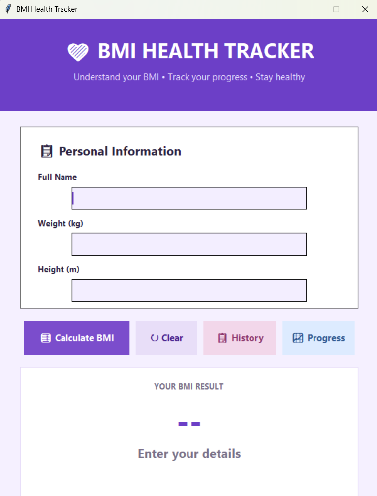
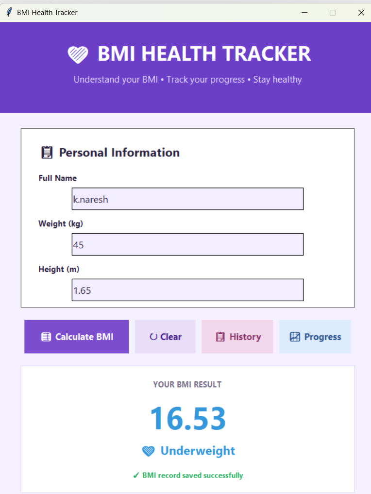
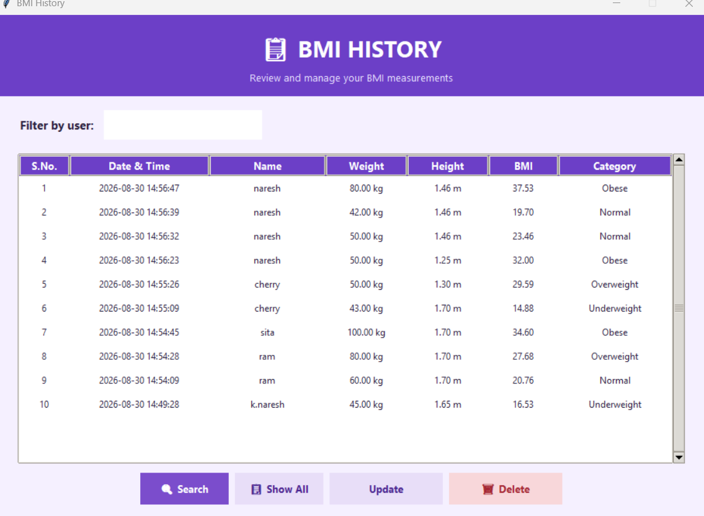
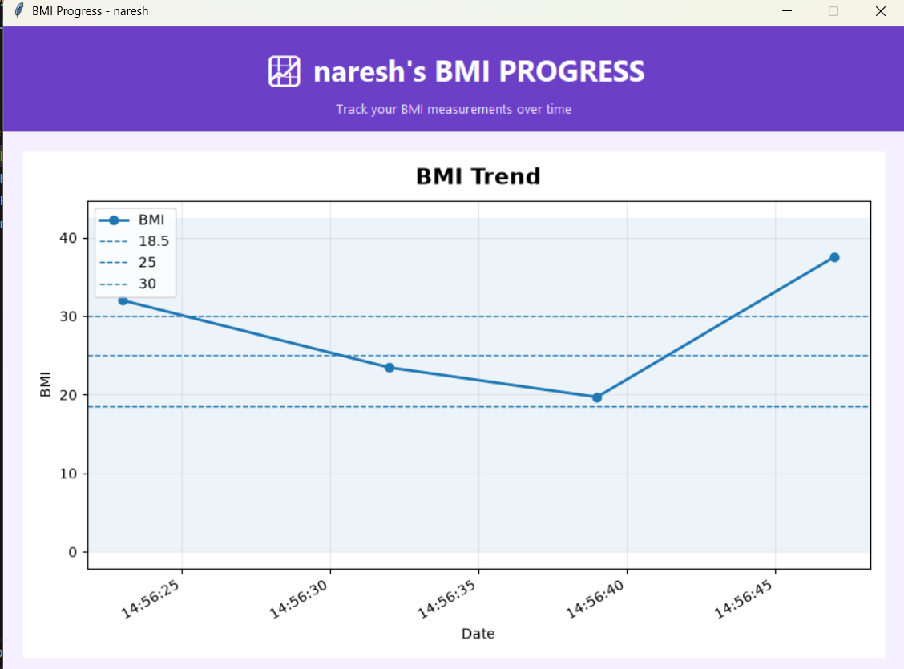

# 💜 BMI Health Tracker

[](https://www.python.org/)
[](https://docs.python.org/3/library/tkinter.html)
[](https://www.sqlite.org/)
[](https://matplotlib.org/)
[](LICENSE)

A modern, feature-rich desktop health application built with **Python**, **Tkinter**, **SQLite**, and **Matplotlib**. **BMI Health Tracker** allows users to calculate Body Mass Index (BMI), track records in a local database, manage historical data with full CRUD operations, and visualize health trends over time.

---

## 📸 Screenshots Showcase

<div align="center">

| **Main Dashboard & Input** | **BMI Result & Feedback** |
| :---: | :---: |
|  |  |

| **BMI History & CRUD Management** | **Visual Progress Tracking** |
| :---: | :---: |
|  |  |

</div>

---

## 📌 Table of Contents

- [Overview](#-overview)
- [Key Features](#-key-features)
- [BMI Classification Standard](#-bmi-classification-standard)
- [Mathematical Formula](#-mathematical-formula)
- [System Architecture & Database Schema](#-system-architecture--database-schema)
- [Technologies Used](#-technologies-used)
- [Getting Started](#-getting-started)
  - [Prerequisites](#prerequisites)
  - [Installation](#installation)
  - [Running the Application](#running-the-application)
- [User Guide & Workflow](#-user-guide--workflow)
- [Directory Structure](#-directory-structure)
- [Contributing](#-contributing)
- [License](#-license)

---

## 📌 Overview

The **BMI Health Tracker** is an intuitive, offline desktop solution engineered for individual health management. It solves the issue of standard one-off calculators by offering **persistent local database storage** and **historical progress visualization**, empowering users to track weight management goals over time.

Built with clean architecture principles, modular functions, robust input validation, and an elegant card-based graphical interface.

---

## ✨ Key Features

- 🧮 **Instant BMI Calculation**: Calculates accurate BMI up to 2 decimal places with instant category assessment.
- 💾 **Persistent SQLite Storage**: Automatically saves user records with precise timestamps (`YYYY-MM-DD HH:MM:SS`).
- 📋 **Historical Records Management**: View stored entries in a structured, color-coded `Treeview` data table with dynamic S.No. indexing.
- 🔍 **Real-Time Search & Filtering**: Instant record lookup by user name.
- ✏️ **Full CRUD Operations**:
  - **Create**: Calculate and auto-save measurements.
  - **Read**: Browse all historical entries.
  - **Update**: Edit existing weight/height entries with live recalculation.
  - **Delete**: Safely remove unwanted records with confirmation prompts.
- 📈 **Graphical Progress Tracking**: Integrated **Matplotlib** charts plot BMI trends over time with dynamic category background color zones.
- 🛡️ **Robust Validation & Error Handling**: Guards against empty fields, non-numeric values, negative numbers, and database exceptions.
- 🎨 **Modern Aesthetic UI**: Features card-based layouts, smooth color coding (Underweight: 💙, Normal: 💚, Overweight: 🧡, Obese: ❤️), custom fonts, and responsive hover effects.

---

## 📊 BMI Classification Standard

The application categorizes BMI results according to standard World Health Organization (WHO) benchmarks:

| BMI Range ($kg/m^2$) | Category | Status Indicator | Visual Theme |
| :---: | :---: | :---: | :---: |
| **< 18.50** | Underweight | 💙 Underweight | Blue (`#3498DB`) |
| **18.50 – 24.99** | Normal Weight | 💚 Normal | Green (`#27AE60`) |
| **25.00 – 29.99** | Overweight | 🧡 Overweight | Orange (`#F39C12`) |
| **≥ 30.00** | Obese | ❤️ Obese | Red (`#E74C3C`) |

---

## 🧠 Mathematical Formula

Body Mass Index is calculated using the standard formula:

$$\text{BMI} = \frac{\text{Weight (kg)}}{\text{Height (m)}^2}$$

*Example calculation:*
- Weight = $70\text{ kg}$
- Height = $1.75\text{ m}$
- $\text{BMI} = \frac{70}{1.75^2} = \frac{70}{3.0625} = 22.86\text{ (Normal Weight)}$

---

## 🗄️ System Architecture & Database Schema

The application uses an embedded **SQLite3** database (`bmi_tracker.db`) which is automatically created on first launch.

### Table Schema: `bmi_records`

| Field | Data Type | Constraints | Description |
| :--- | :--- | :--- | :--- |
| `id` | `INTEGER` | `PRIMARY KEY AUTOINCREMENT` | Unique database identifier |
| `user_name` | `TEXT` | `NOT NULL` | Full name of the user |
| `weight` | `REAL` | `NOT NULL` | Weight in kilograms (kg) |
| `height` | `REAL` | `NOT NULL` | Height in meters (m) |
| `bmi` | `REAL` | `NOT NULL` | Calculated Body Mass Index |
| `category` | `TEXT` | `NOT NULL` | Health classification category |
| `date_time` | `TEXT` | `NOT NULL` | ISO timestamp (`YYYY-MM-DD HH:MM:SS`) |

---

## 🛠️ Technologies Used

| Technology | Role & Usage |
| :--- | :--- |
| **[Python 3.8+](https://www.python.org/)** | Core programming language |
| **[Tkinter / ttk](https://docs.python.org/3/library/tkinter.html)** | Desktop Graphical User Interface (GUI) framework |
| **[SQLite3](https://www.sqlite.org/)** | Embedded lightweight relational database |
| **[Matplotlib](https://matplotlib.org/)** | Data visualization for rendering progress charts |

---

## 🚀 Getting Started

### Prerequisites

Ensure you have Python installed on your system:
- **Python 3.8** or higher ([Download Python](https://www.python.org/downloads/))
- `pip` package manager

### Installation

1. **Clone the Repository**
   ```bash
   git clone https://github.com/nandini-k-19/OIBSIP.git
   cd python-L1-Task2-BMI\ Calculator
   ```

2. **(Optional) Create a Virtual Environment**
   ```bash
   # Windows
   python -m venv venv
   venv\Scripts\activate

   # macOS / Linux
   python3 -m venv venv
   source venv/bin/activate
   ```

3. **Install Dependencies**
   ```bash
   pip install -r requirements.txt
   ```

### Running the Application

Launch the application using Python:

```bash
python bmi_health_tracker.py
```

---

## 📖 User Guide & Workflow

1. **Calculate BMI**:
   - Enter your **Full Name**, **Weight (kg)**, and **Height (m)**.
   - Click **🧮 Calculate BMI**.
   - Your BMI score and health category will be displayed immediately, and saved to the database.

2. **View & Search History**:
   - Click **📋 History** to open the records window.
   - Filter records by typing a name in the search bar and clicking **🔍 Search**.
   - Click **📋 Show All** to reset filters.

3. **Update a Record**:
   - Select a row in the History table and click **Update**.
   - Enter updated weight/height values and click **✓ Update Record**.

4. **Delete a Record**:
   - Select a row in the History table and click **🗑 Delete**.
   - Confirm deletion in the prompt dialog.

5. **Track Progress Chart**:
   - Enter a user name on the main screen and click **📈 Progress**.
   - A Matplotlib chart will display the weight/BMI trend over time with shaded category zones.

---

## 📁 Directory Structure

```text
python-L1-Task2-BMI Calculator/
├── screenshots/
│   ├── home-screen.png      # Dashboard screenshot
│   ├── bmi-result.png       # Result screen screenshot
│   ├── bmi-history.png      # History table screenshot
│   └── bmi-progress.png     # Progress chart screenshot
├── bmi_health_tracker.py    # Main Application Source Code
├── bmi_tracker.db           # SQLite Database (Auto-generated on startup)
├── requirements.txt         # Project Dependencies
└── README.md                # Project Documentation
```

---

## 🤝 Contributing

Contributions are welcome! If you'd like to improve the app or add new features:

1. Fork the repository.
2. Create a feature branch (`git checkout -b feature/AmazingFeature`).
3. Commit your changes (`git commit -m 'Add some AmazingFeature'`).
4. Push to the branch (`git push origin feature/AmazingFeature`).
5. Open a Pull Request.

---

## 📜 License

Distributed under the MIT License. See `LICENSE` for more information.

---

<div align="center">
  <sub>Built with 💜 by Nandini | Oasis InfoByte Internship Project</sub>
</div>